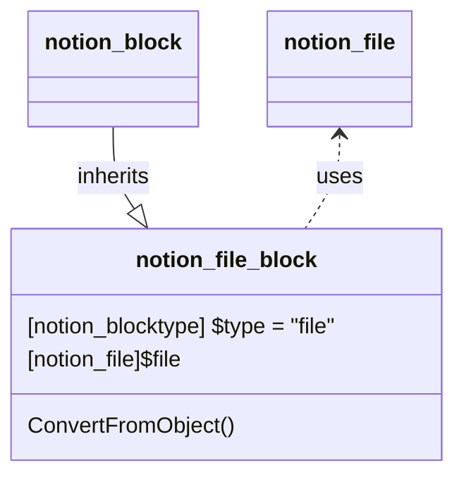

# Block: File_block

[API reference](https://developers.notion.com/reference/block#file)

```mermaid
classDiagram
    class notion_file_block {
        [notion_blocktype] $type = "file"
        [notion_file]$file
        ConvertFromObject()
    }
    `notion_block` --|> `notion_file_block`:inherits
    `notion_file` <.. `notion_file_block`:uses
```
