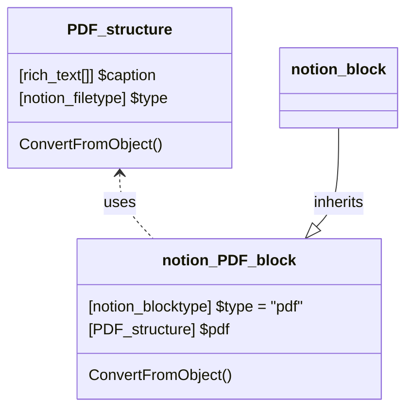

# Block: PDF

[API reference](https://developers.notion.com/reference/block#pdf)

```mermaid
classDiagram
    class PDF_structure {
        [rich_text[]] $caption
        [notion_filetype] $type
        ConvertFromObject()
    }
    
    class notion_PDF_block {
        [notion_blocktype] $type = "pdf"
        [PDF_structure] $pdf
        ConvertFromObject()
    }
    `PDF_structure` <.. `notion_PDF_block`:uses
    `notion_block` --|> `notion_PDF_block`:inherits
```
