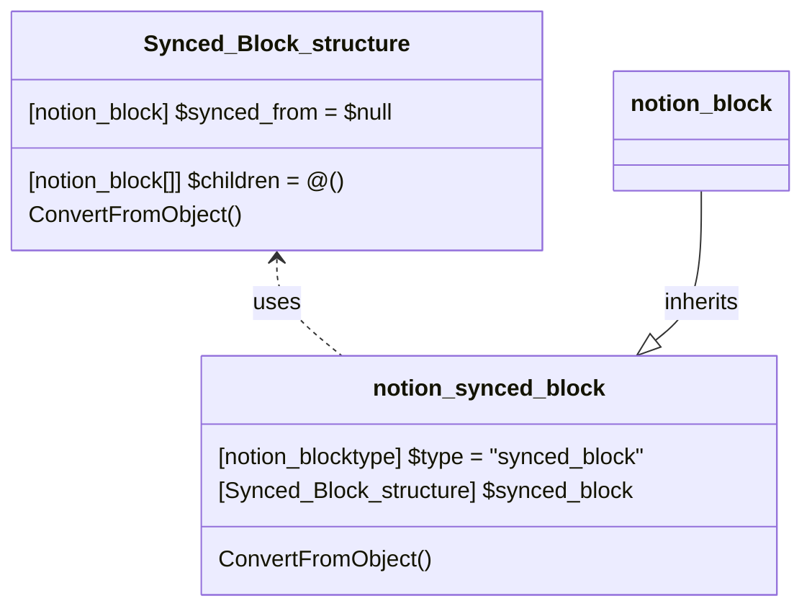

# Block: Synced_block

[API reference](https://developers.notion.com/reference/block#synced-block)

```mermaid
classDiagram
    class Synced_Block_structure {
        [notion_block] $synced_from = $null
        [notion_block[]] $children = @()
        ConvertFromObject()
    }

    class notion_synced_block {
        [notion_blocktype] $type = "synced_block"
        [Synced_Block_structure] $synced_block
        ConvertFromObject()
    }
    `Synced_Block_structure` <.. `notion_synced_block`:uses
    `notion_block` --|> `notion_synced_block`:inherits
```
