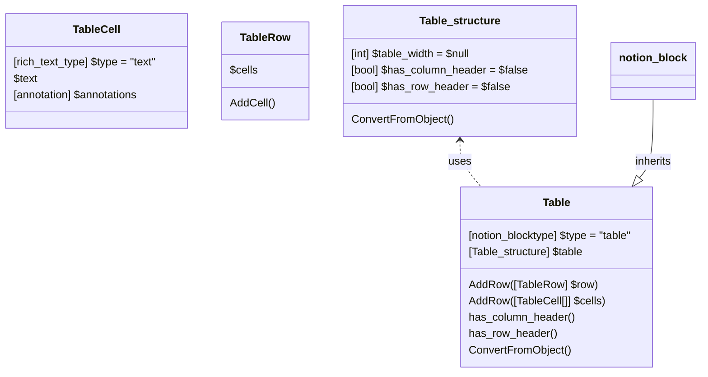

# Block: Table

[API reference](https://developers.notion.com/reference/block#table)

```mermaid
classDiagram
    class TableCell {
        [rich_text_type] $type = "text"
        $text
        [annotation] $annotations
    }

    class TableRow {
        $cells
        AddCell()
    }

    class Table_structure {
        [int] $table_width = $null
        [bool] $has_column_header = $false
        [bool] $has_row_header = $false
        ConvertFromObject()
    }
    
    class Table {
        [notion_blocktype] $type = "table"
        [Table_structure] $table
        AddRow ([TableRow] $row)
        AddRow ([TableCell[]] $cells)
        has_column_header ()
        has_row_header ()
        ConvertFromObject()
    }
    `Table_structure` <.. `Table`:uses
    `notion_block` --|> `Table`:inherits

```
## TODO: Name falsch (table -> notion_table_block)
