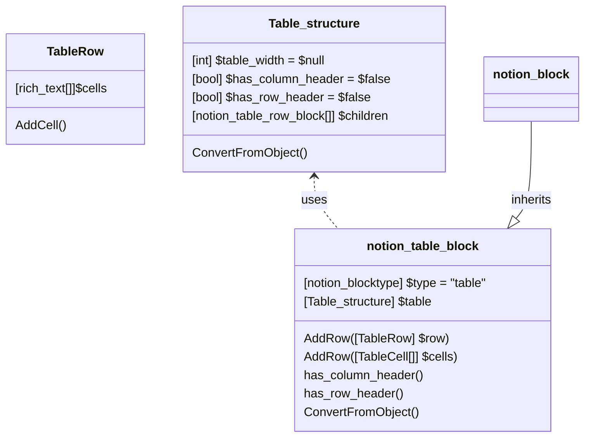

# Block: Table

[API reference](https://developers.notion.com/reference/block#table)

```mermaid
classDiagram

    class TableRow {
        [rich_text[]]$cells
        AddCell()
    }

    class Table_structure {
        [int] $table_width = $null
        [bool] $has_column_header = $false
        [bool] $has_row_header = $false
        [notion_table_row_block[]] $children
        ConvertFromObject()
    }
    
    class notion_table_block {
        [notion_blocktype] $type = "table"
        [Table_structure] $table
        AddRow ([TableRow] $row)
        AddRow ([TableCell[]] $cells)
        has_column_header ()
        has_row_header ()
        ConvertFromObject()
    }
    `Table_structure` <.. `notion_table_block`:uses
    `notion_block` --|> `notion_table_block`:inherits

```
