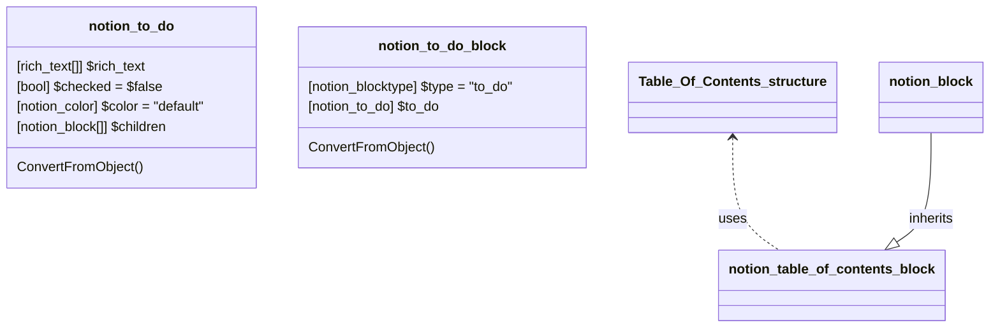

# Block: To_do

[API reference](# https://developers.notion.com/reference/block#to-do)

```mermaid
classDiagram

class notion_to_do {
    [rich_text[]] $rich_text
    [bool] $checked = $false
    [notion_color] $color = "default"
    [notion_block[]] $children
    ConvertFromObject()
}

class notion_to_do_block {
    [notion_blocktype] $type = "to_do"
    [notion_to_do] $to_do
    ConvertFromObject()
}
`Table_Of_Contents_structure` <.. `notion_table_of_contents_block`:uses
`notion_block` --|> `notion_table_of_contents_block`:inherits
```
## TODO: Name falsch (notion_to_do -> to_do_structure)
