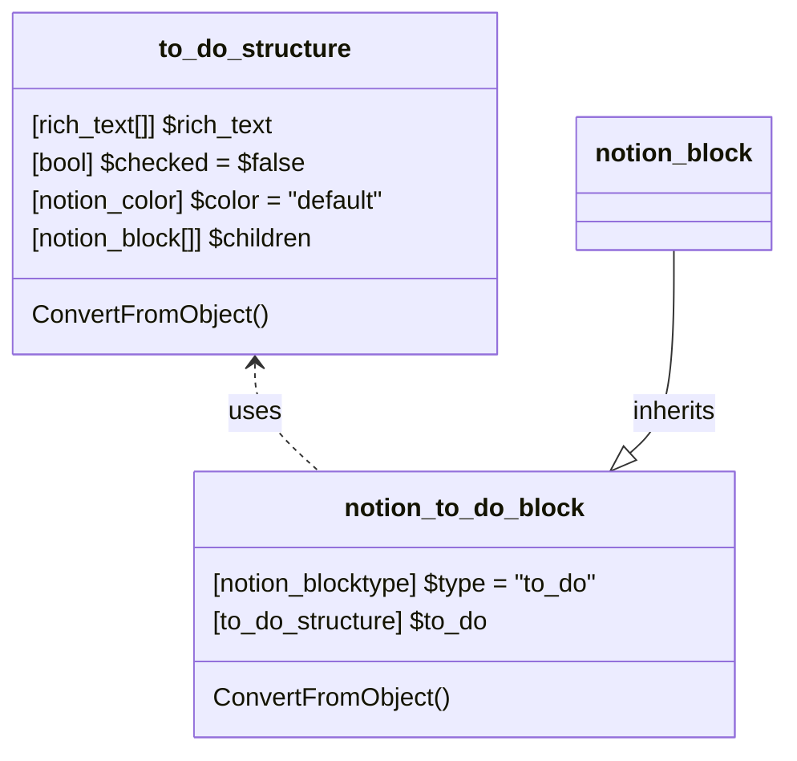

# Block: To_do

[API reference](# https://developers.notion.com/reference/block#to-do)

```mermaid
classDiagram

class to_do_structure {
    [rich_text[]] $rich_text
    [bool] $checked = $false
    [notion_color] $color = "default"
    [notion_block[]] $children
    ConvertFromObject()
}

class notion_to_do_block {
    [notion_blocktype] $type = "to_do"
    [to_do_structure] $to_do
    ConvertFromObject()
}
`to_do_structure` <.. `notion_to_do_block`:uses
`notion_block` --|> `notion_to_do_block`:inherits
```
