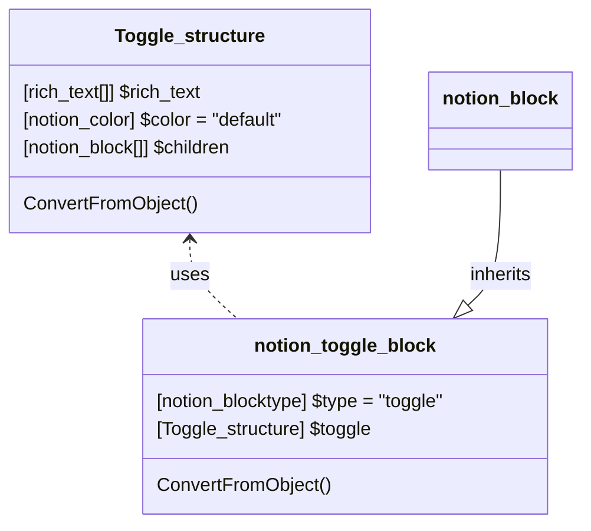

# Block: Toggle

[API reference](https://developers.notion.com/reference/block#toggle-blocks)

```mermaid
classDiagram
    class Toggle_structure {
        [rich_text[]] $rich_text
        [notion_color] $color = "default"
        [notion_block[]] $children
        ConvertFromObject()
    }

    class notion_toggle_block {
        [notion_blocktype] $type = "toggle"
        [Toggle_structure] $toggle
        ConvertFromObject()
    }
    `Toggle_structure` <.. `notion_toggle_block`:uses
    `notion_block` --|> `notion_toggle_block`:inherits
```
