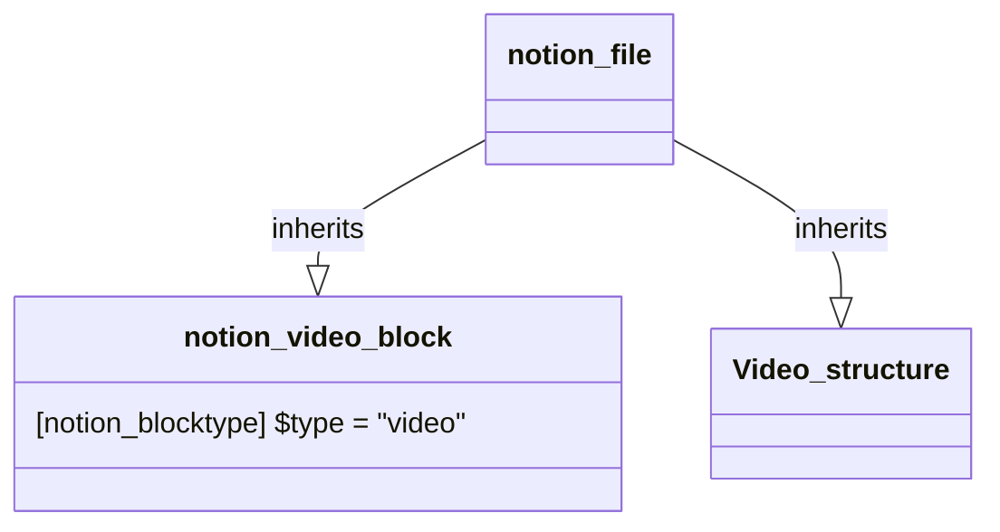

# Block: Video

[API reference](https://developers.notion.com/reference/block#video)

```mermaid
classDiagram
    class Video_structure {
    }

    class notion_video_block  {
        [notion_blocktype] $type = "video"
    }
    `notion_file` --|> `notion_video_block`:inherits
    `notion_file` --|> `Video_structure`:inherits
```

## TODO: `Video_structure` <.. `notion_video_block`:uses
