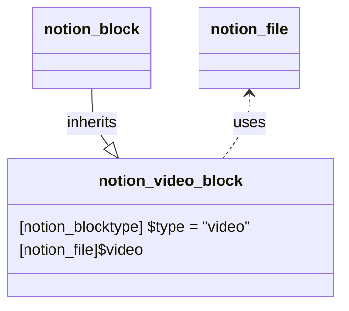

# Block: Video

[API reference](https://developers.notion.com/reference/block#video)

```mermaid
classDiagram
    class notion_video_block  {
        [notion_blocktype] $type = "video"
        [notion_file]$video
    }
    `notion_block` --|> `notion_video_block`:inherits
    `notion_file` <.. `notion_video_block`:uses
```
