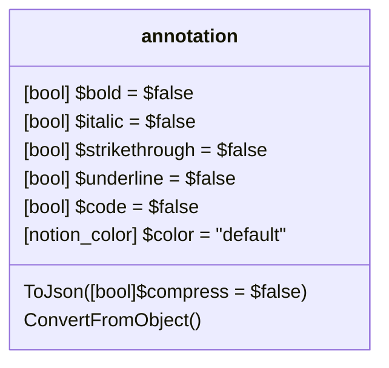

# Rich_text: Annotations 

[API Reference](https://developers.notion.com/reference/rich-text#the-annotation-object)

```mermaid
classDiagram
    class annotation {
        [bool] $bold = $false
        [bool] $italic = $false
        [bool] $strikethrough = $false
        [bool] $underline = $false
        [bool] $code = $false
        [notion_color] $color = "default"
        ToJson([bool]$compress = $false)
        ConvertFromObject()
    }
```
