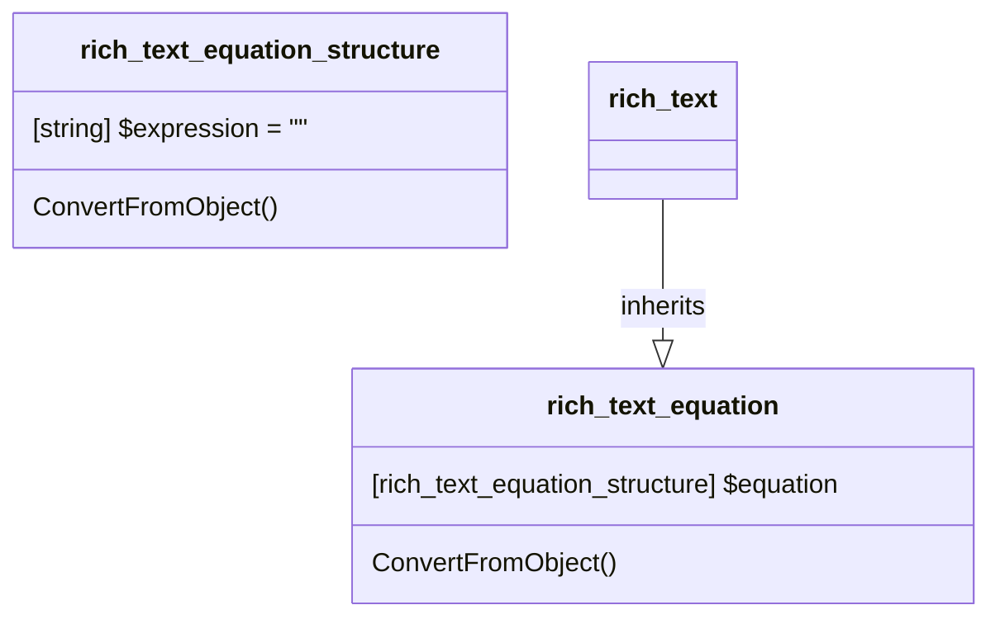

# Rich_Text: Equation

[API Reference](https://developers.notion.com/reference/rich-text#equation)

```mermaid
classDiagram
    class rich_text_equation_structure {
    [string] $expression = ""
    ConvertFromObject()    
    }

    class rich_text_equation {
        [rich_text_equation_structure] $equation
        ConvertFromObject()
    }
    `rich_text` --|> `rich_text_equation`:inherits
```
