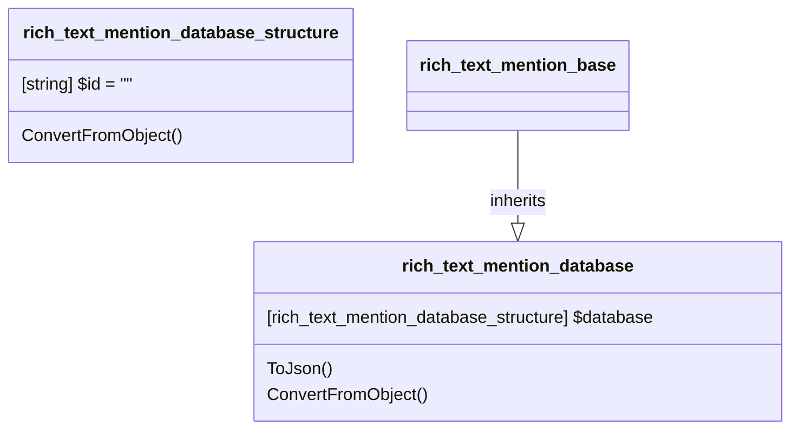

# Rich_Text: Mention: Database

[API Reference](https://developers.notion.com/reference/rich-text#mention)

```mermaid
classDiagram
    class rich_text_mention_database_structure {
        [string] $id = ""
        ConvertFromObject()
    }

    class rich_text_mention_database {
        [rich_text_mention_database_structure] $database
        ToJson()
        ConvertFromObject()
    }
    `rich_text_mention_base` --|> `rich_text_mention_database`:inherits
```
