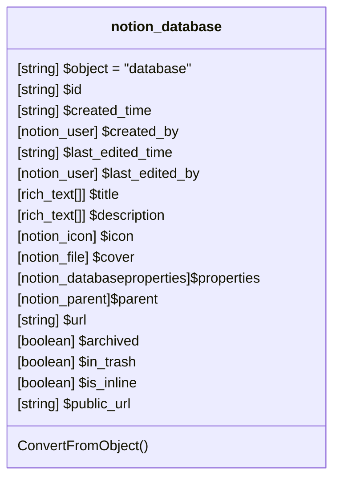

# Database

[API Reference](https://developers.notion.com/reference/database)

```mermaid
classDiagram
    class notion_database {
        [string] $object = "database"
        [string] $id
        [string] $created_time
        [notion_user] $created_by
        [string] $last_edited_time
        [notion_user] $last_edited_by
        [rich_text[]] $title
        [rich_text[]] $description
        [notion_icon] $icon
        [notion_file] $cover
        [notion_databaseproperties]$properties
        [notion_parent]$parent
        [string] $url
        [boolean] $archived
        [boolean] $in_trash
        [boolean] $is_inline
        [string] $public_url
        ConvertFromObject()
    }
```
