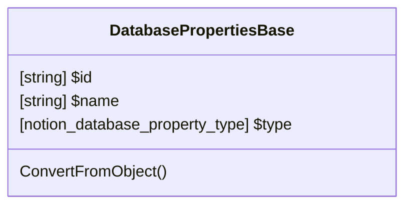

# DatabaseProperty_Base

All database objects include a child properties object. 
This properties object is composed of individual database property objects. 
These property objects define the database schema and are rendered in the Notion UI as database columns.

[API Reference: Property Schema Object](https://developers.notion.com/reference/property-schema-object)

[API Reference: Page Property Values](https://developers.notion.com/reference/page-property-values)

