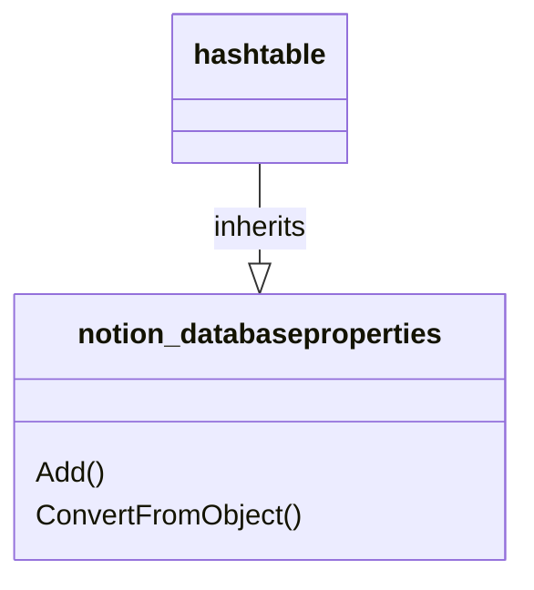

# DatabaseProperty: DB

[API Reference](https://developers.notion.com/reference/page-property-values)

The database properties have a name, which is the key and a value, which is the actual property. This matches the built-in functionality of a hashtable, therefore the database properties are derived from the class Hashtable.

## Database: Properties

* [dp_checkbox](./02_dp_checkbox.md)
* [dp_created_by](./03_dp_created_by.md)
* [dp_created_time](./04_dp_created_time.md)
* [dp_date](./05_dp_date.md)
* [dp_email](./07_dp_email.md)
* [dp_files](./08_dp_files.md)
* [dp_formula](./09_dp_formula.md)
* [dp_last_edited_by](./10_dp_last_edited_by.md)
* [dp_last_edited_time](./11_dp_last_edited_time.md)
* [dp_multi_select](./12_dp_multi_select.md)
* [dp_number](./13_dp_number.md)
* [dp_people](./14_dp_people.md)
* [dp_phone_number](./15_dp_phone_number.md)
* [dp_relation](./16_dp_relation.md)
* [dp_rich_text](./17_dp_rich_text.md)
* [dp_rollup](./18_dp_rollup.md)
* [dp_select](./19_dp_select.md)
* [dp_status](./20_dp_status.md)
* [dp_title](./21_dp_title.md)
* [dp_url](./22_dp_url.md)
* [dp_unique_id](./23_dp_unique_id.md)
