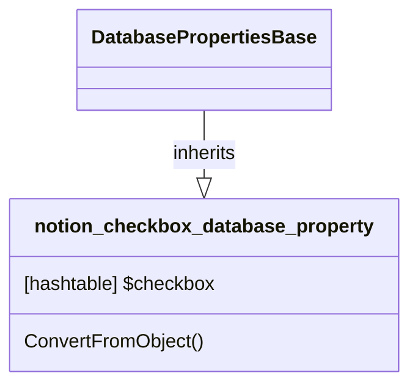

# DatabaseProperty: Checkbox

[API Reference](https://developers.notion.com/reference/property-object#checkbox)

As this is only to let the database know that the property is a checkbox, the only thing that is needed is the name of the property. This is stored in a hashtable, which is the base class for all database properties.

## Related Classes

- [DatabasePropertiesBase](./00_dp_DatabasePropertiesBase.md)
