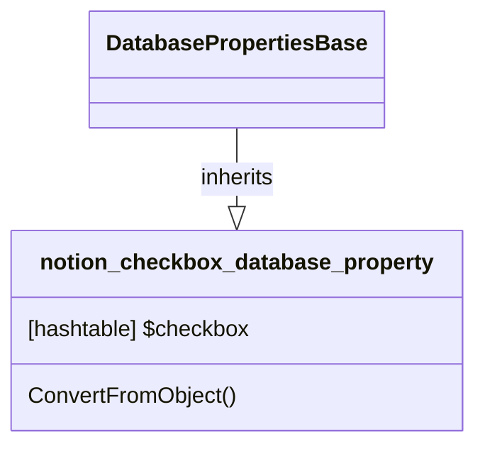

# DatabaseProperty: Checkbox

[API Reference](https://developers.notion.com/reference/property-object#checkbox)

```mermaid
classDiagram
    class notion_checkbox_database_property {
        [hashtable] $checkbox
        ConvertFromObject()
    }
    `DatabasePropertiesBase` --|> `notion_checkbox_database_property`:inherits
```
