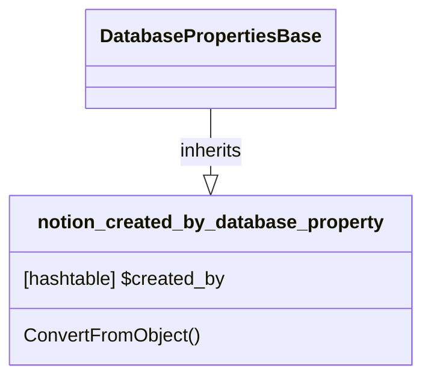

# DatabaseProperty: Created_by

[API Reference](https://developers.notion.com/reference/property-object#created-by)

```mermaid
classDiagram
    class notion_created_by_database_property {
        [hashtable] $created_by
        ConvertFromObject()
    }
`DatabasePropertiesBase` --|> `notion_created_by_database_property`:inherits
```
