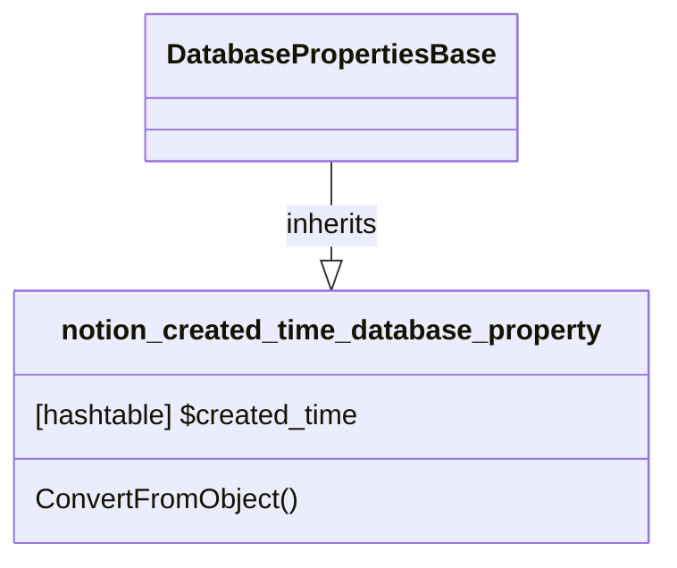

# DatabaseProperty: Created_time

[API Reference](https://developers.notion.com/reference/property-object#created-time)

## Related Classes

- [DatabasePropertiesBase](./00_dp_DatabasePropertiesBase.md)
