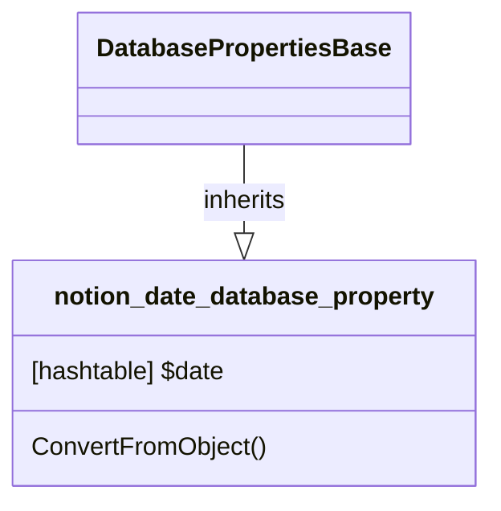

# DatabaseProperty: Date

[API Reference](https://developers.notion.com/reference/property-object#date)

```mermaid
classDiagram
    class notion_date_database_property {
        [hashtable] $date
        ConvertFromObject()
    }
    `DatabasePropertiesBase` --|> `notion_date_database_property`:inherits
```
