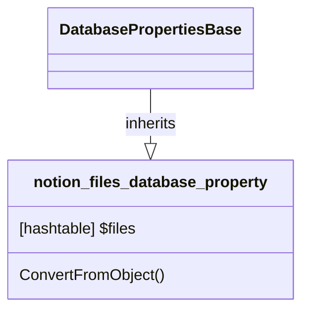

# DatabaseProperty: Files

[API Reference](https://developers.notion.com/reference/property-object#files)

```mermaid
classDiagram
    class notion_files_database_property {
        [hashtable] $files
        ConvertFromObject()
    }
    `DatabasePropertiesBase` --|> `notion_files_database_property`:inherits
```

## Related Classes

- [DatabasePropertiesBase](./00_dp_DatabasePropertiesBase.md)
