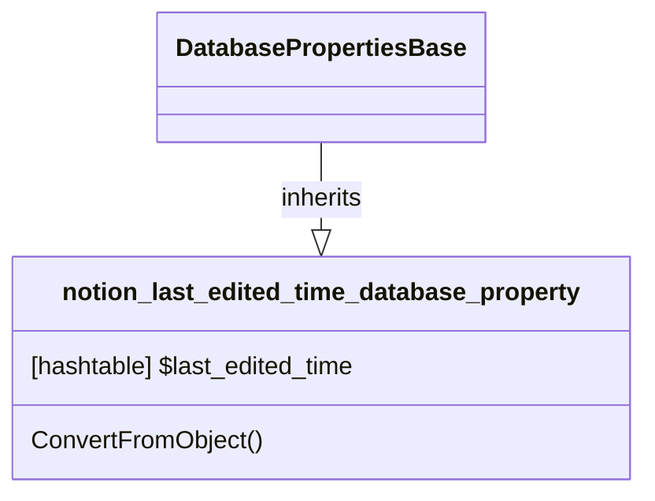

# DatabaseProperty: Last_edited_time

[API Reference](https://developers.notion.com/reference/property-object#last-edited-time)

## Related Classes

- [DatabasePropertiesBase](./00_dp_DatabasePropertiesBase.md)
