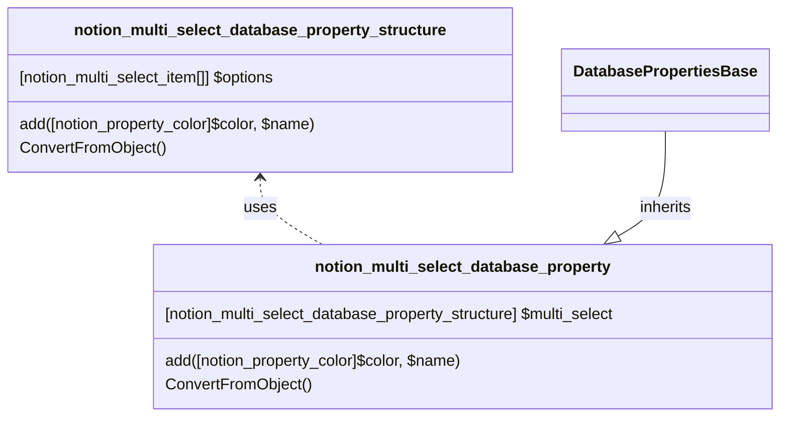

# DatabaseProperty: Multi_select

[API Reference](https://developers.notion.com/reference/property-object#multi-select)

```mermaid
classDiagram
    class notion_multi_select_database_property_structure{
        [notion_multi_select_item[]] $options
        add([notion_property_color]$color, $name)
        ConvertFromObject()
    }

    class notion_multi_select_database_property {
        [notion_multi_select_database_property_structure] $multi_select
        add([notion_property_color]$color, $name)
        ConvertFromObject()
    }
    `notion_multi_select_database_property_structure` <.. `notion_multi_select_database_property`:uses
    `DatabasePropertiesBase` --|> `notion_multi_select_database_property`:inherits
```
