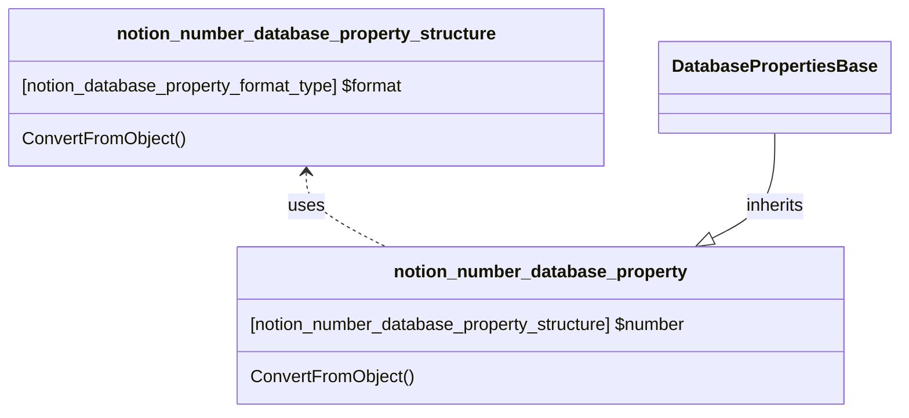

# DatabaseProperty: Number

[API Reference](https://developers.notion.com/reference/property-object#number)

```mermaid
classDiagram
    class notion_number_database_property_structure {
        [notion_database_property_format_type] $format
        ConvertFromObject()
    }

    class notion_number_database_property {
        [notion_number_database_property_structure] $number
        ConvertFromObject()
    }
    `notion_number_database_property_structure` <.. `notion_number_database_property`:uses
    `DatabasePropertiesBase` --|> `notion_number_database_property`:inherits
```

## Related Classes

- [DatabasePropertiesBase](./00_dp_DatabasePropertiesBase.md)
