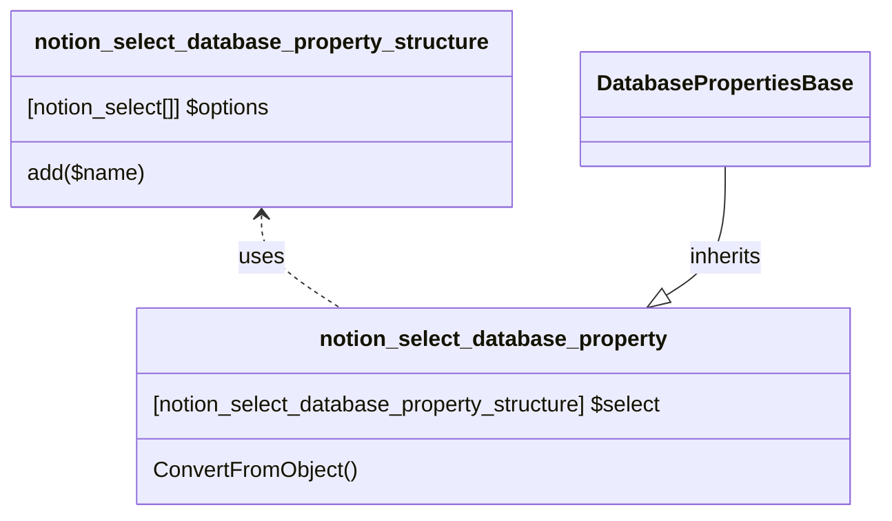

# DatabaseProperty: Select

[API Reference](https://developers.notion.com/reference/property-object#select)

```mermaid
classDiagram
    class notion_select_database_property_structure{
        [notion_select[]] $options
        add($name)
    }


    class notion_select_database_property {
        [notion_select_database_property_structure] $select
        ConvertFromObject()
    }
    `notion_select_database_property_structure` <.. `notion_select_database_property`:uses
    `DatabasePropertiesBase` --|> `notion_select_database_property`:inherits
```
