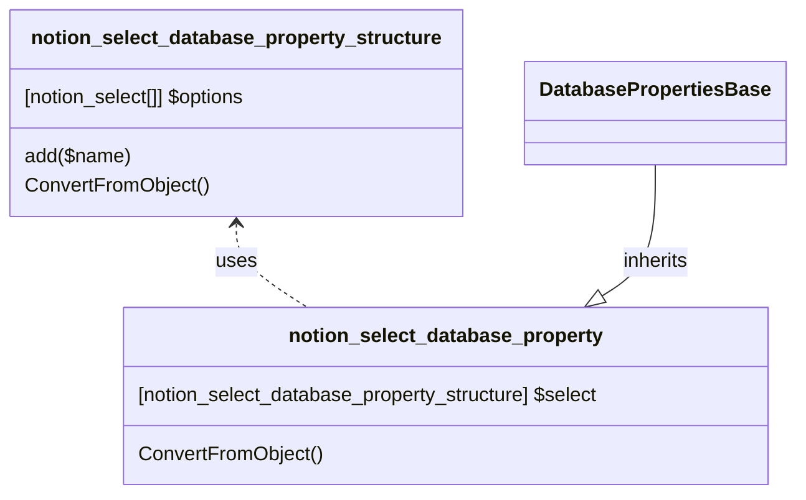

# DatabaseProperty: Select

[API Reference](https://developers.notion.com/reference/property-object#select)

## Related Objects

- [DatabasePropertiesBase](./00_dp_DatabasePropertiesBase.md)
- [notion_select](../../General/19_select.md)
