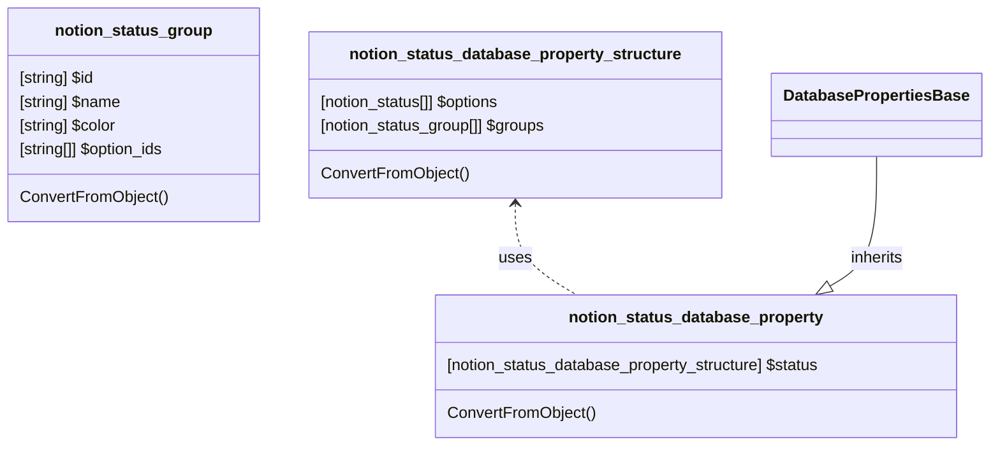

# DatabaseProperty: Status

[API Reference](https://developers.notion.com/reference/property-object#status)

```mermaid
classDiagram
class notion_status_group {
    [string] $id
    [string] $name
    [string] $color
    [string[]] $option_ids
    ConvertFromObject()
}

class notion_status_database_property_structure {
    [notion_status[]] $options
    [notion_status_group[]] $groups
    ConvertFromObject()
}


class notion_status_database_property {
    [notion_status_database_property_structure] $status
     ConvertFromObject()
    }
    `notion_status_database_property_structure` <.. `notion_status_database_property`:uses
    `DatabasePropertiesBase` --|> `notion_status_database_property`:inherits
```
