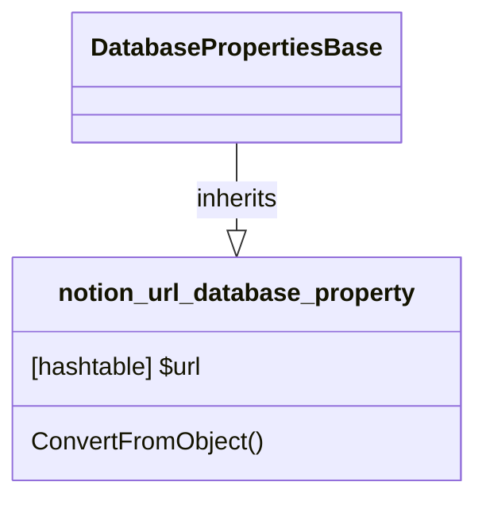

# DatabaseProperty: Url

[API Reference](https://developers.notion.com/reference/property-object#url)

```mermaid
classDiagram
    class notion_url_database_property {
        [hashtable] $url
        ConvertFromObject()
    }
    `DatabasePropertiesBase` --|> `notion_url_database_property`:inherits
```

## Related Classes

- [DatabasePropertiesBase](./00_dp_DatabasePropertiesBase.md)
