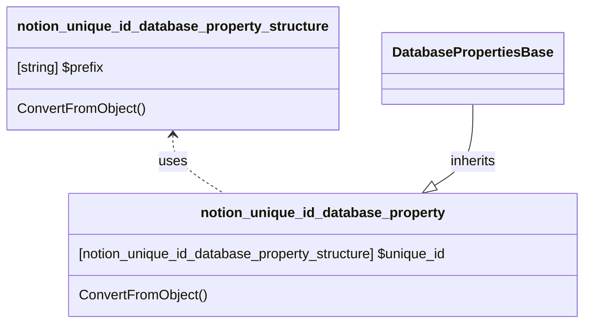

# DatabaseProperty: Unique_id

[API Reference: not documented!]()

```mermaid
classDiagram
    class notion_unique_id_database_property_structure{
        [string] $prefix
        ConvertFromObject()
    }

    class notion_unique_id_database_property {
        [notion_unique_id_database_property_structure] $unique_id
        ConvertFromObject()
    }
    `notion_unique_id_database_property_structure` <.. `notion_unique_id_database_property`:uses
    `DatabasePropertiesBase` --|> `notion_unique_id_database_property`:inherits
```

## Related Classes

- [DatabasePropertiesBase](./00_dp_DatabasePropertiesBase.md)
