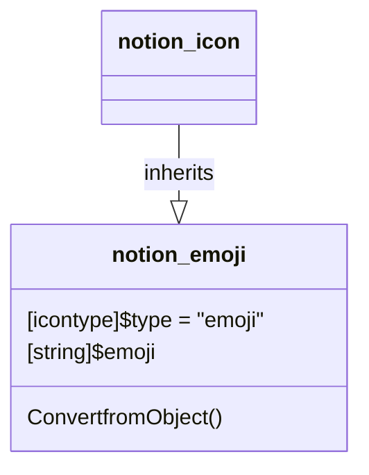

# Emoji

[API Reference](https://developers.notion.com/reference/notion_emoji-object)

```mermaid
classDiagram
    class notion_emoji {
        [icontype]$type = "emoji"
        [string]$emoji
        ConvertfromObject()
    }
    `notion_icon` --|> `notion_emoji`:inherits
```
