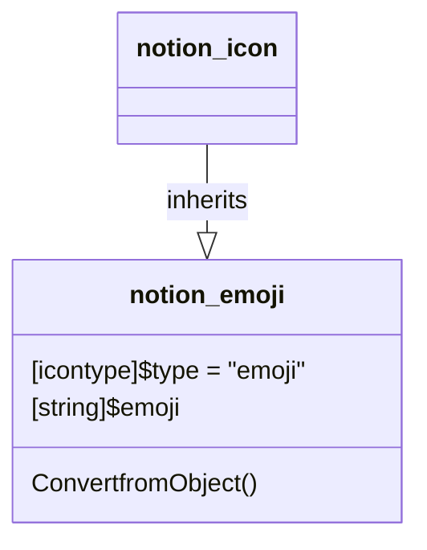

# Emoji

[API Reference](https://developers.notion.com/reference/notion_emoji-object)

It is also possible to use custom emojis in Notion. See the documentation here: [Custom Emoji](./02_custom_emoji.md)
