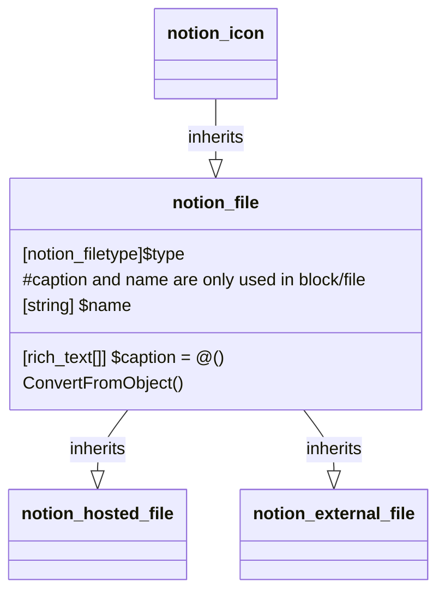

# File

[API Reference File Object](https://developers.notion.com/reference/file-object)

[API Reference Block: File](https://developers.notion.com/reference/block#file)

## Related Classes

- [notion_icon](../General/00_icon.md)
- [notion_hosted_file](./02_notion_hosted_file.md)
- [notion_external_file](./03_external_file.md)

## Child Classes

- [notion_hosted_file](./02_notion_hosted_file.md)
- [notion_external_file](./03_external_file.md)
