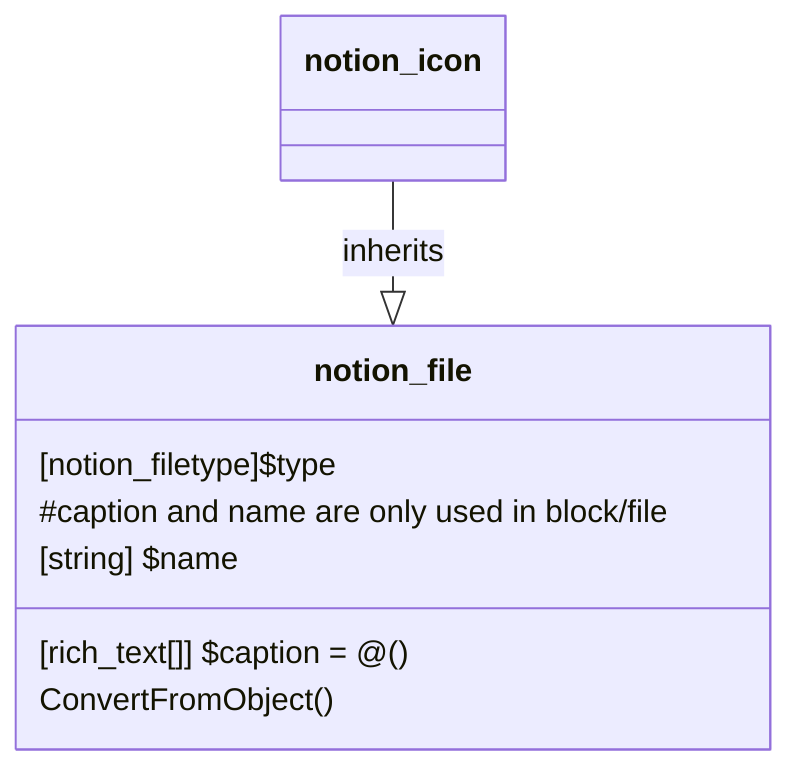

# File

[API Reference File Object](https://developers.notion.com/reference/file-object)

[API Reference Block: File](https://developers.notion.com/reference/block#file)

```mermaid
classDiagram
    class notion_file {
        [notion_filetype]$type
        #caption and name are only used in block/file
        [rich_text[]] $caption = @()
        [string] $name
        ConvertFromObject()
    }
    `notion_icon` --|> `notion_file`:inherits
```
