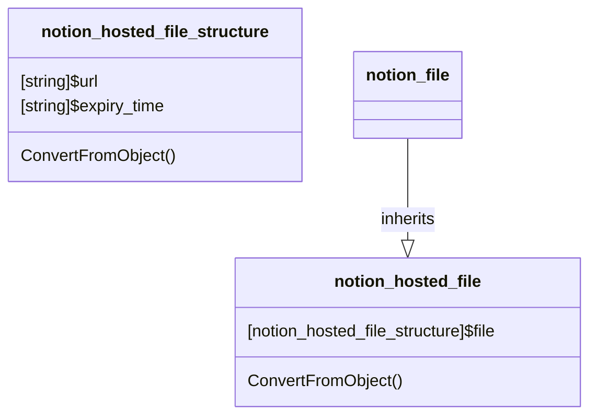

# File: Notion_hosted_file

[API Reference](https://developers.notion.com/reference/file-object#notion-hosted-files)

```mermaid
classDiagram
    class notion_hosted_file_structure {
        [string]$url
        [string]$expiry_time
        ConvertFromObject()
    }

    class notion_hosted_file {
        [notion_hosted_file_structure]$file
        ConvertFromObject()
    }
    `notion_file` --|> `notion_hosted_file`:inherits
```
