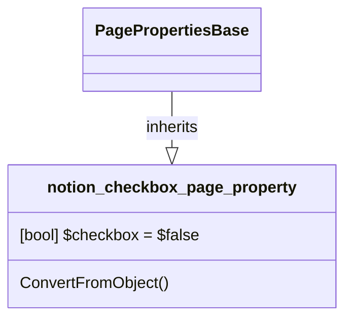

# PageProperty: Checkbox

[API Refernce](https://developers.notion.com/reference/page-property-values#checkbox)

```mermaid
classDiagram
    class notion_checkbox_page_property {
        [bool] $checkbox = $false
        ConvertFromObject()
    }
    `PagePropertiesBase` --|> `notion_checkbox_page_property`:inherits
```
