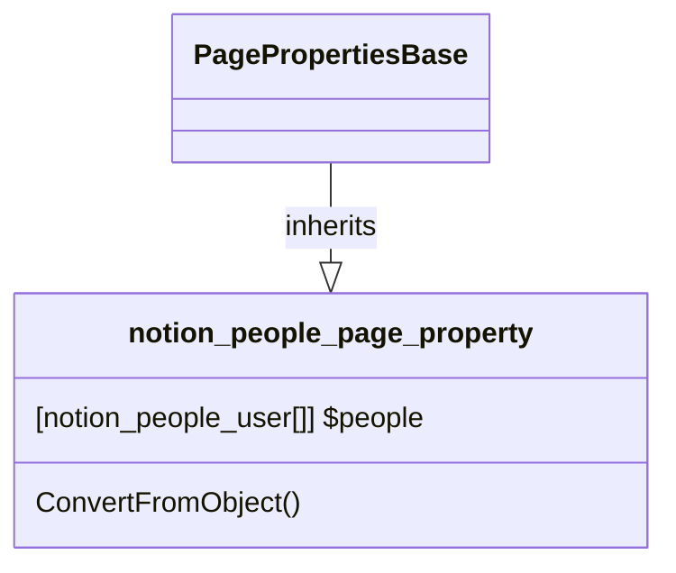

# PageProperty: People

[API Reference](https://developers.notion.com/reference/page-property-values#people)

## Related Classes

- [PagePropertiesBase](./00_pp_base.md)
- [notion_people_user](../../User/02_people.md)
