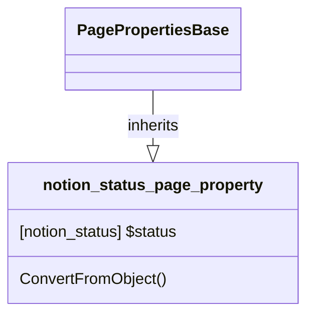

# PageProperty: Status

[API Refernce](https://developers.notion.com/reference/page-property-values#status)

```mermaid
classDiagram
    class notion_status_page_property {
        [notion_status] $status
        ConvertFromObject()
    }
    `PagePropertiesBase` --|> `notion_status_page_property`:inherits
```
