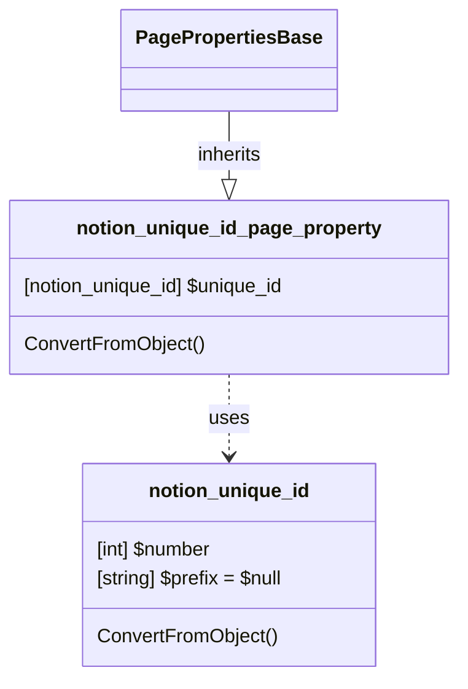

# PageProperty: Unique_id

[API Reference](https://developers.notion.com/reference/page-property-values#unique-id)

```mermaid
classDiagram
    class notion_unique_id {
        [int] $number
        [string] $prefix = $null
        ConvertFromObject()
    }

    class notion_unique_id_page_property {
        [notion_unique_id] $unique_id
        ConvertFromObject()
    }
    `PagePropertiesBase` --|> `notion_unique_id_page_property`:inherits
    `notion_unique_id_page_property` ..> `notion_unique_id`:uses
```

## Related Classes

- [PagePropertiesBase](./00_pp_base.md)
