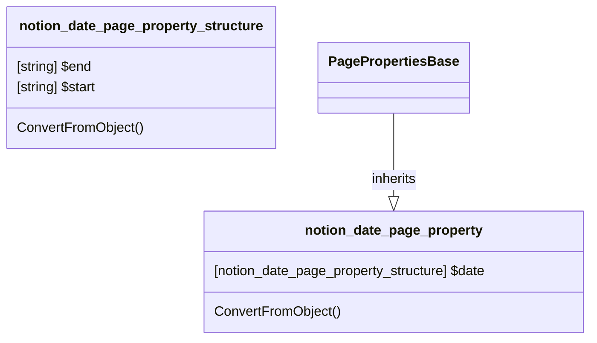

# PageProperty: Date

[API Reference](https://developers.notion.com/reference/page-property-values#date)

## Remarks

The internal function `ConvertTo-NotionFormattedDateTime` is used to validate the input and convert it to a Notion-formatted DateTime string.

## Related Classes

- [PagePropertiesBase](./00_pp_base.md)
