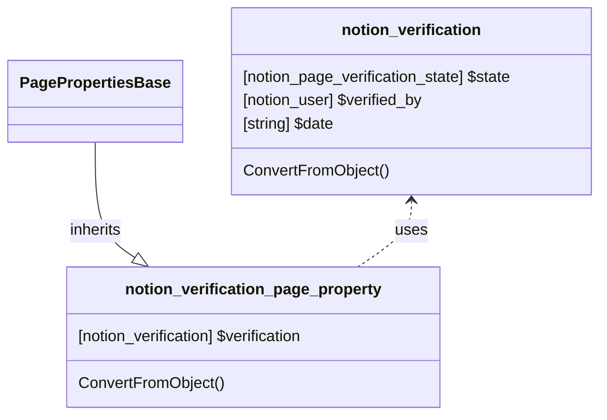

# PageProperty: Verification

[API Reference](https://developers.notion.com/reference/page-property-values#verification)

```mermaid
classDiagram
    class notion_verification {
        [notion_page_verification_state] $state
        [notion_user] $verified_by
        [string] $date
        ConvertFromObject()
    }

    class notion_verification_page_property {
        [notion_verification] $verification
        ConvertFromObject()
    }
    `PagePropertiesBase` --|> `notion_verification_page_property`:inherits
    `notion_verification` <.. `notion_verification_page_property`:uses
```

## Related Classes

- [PagePropertiesBase](./00_pp_base.md)
