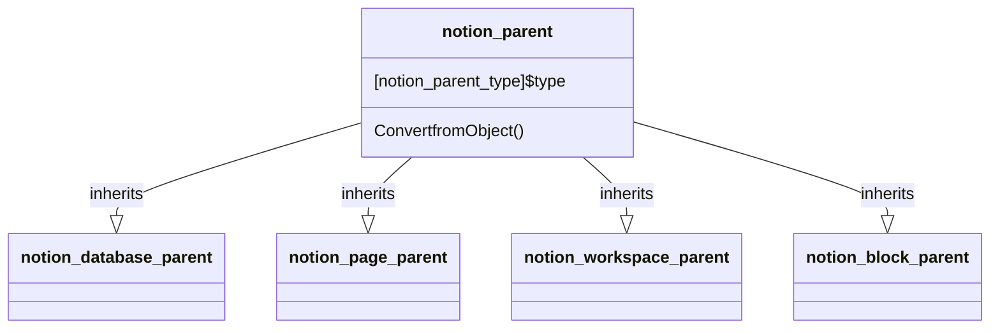

# Parent

[API Reference](https://developers.notion.com/reference/parent-object)

## Child classes

- [notion_database_parent](./01_database_parent.md)
- [notion_page_parent](./02_page_parent.md)
- [notion_workspace_parent](./03_workspace_parent.md)
- [notion_block_parent](./04_block_parent.md)
