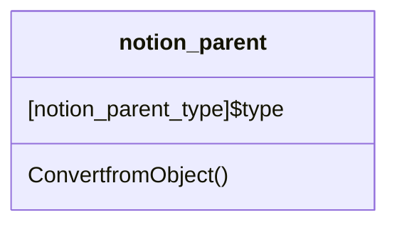

# Parent

[API Reference](https://developers.notion.com/reference/parent-object)

```mermaid
classDiagram
    class notion_parent {
        [notion_parent_type]$type
        ConvertfromObject()
    }
```
