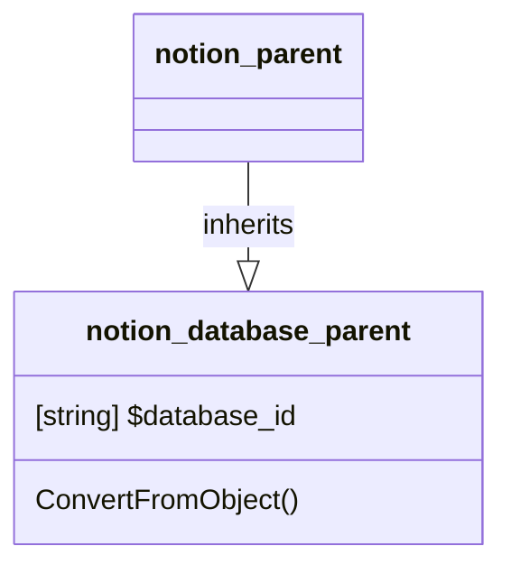

# Parent: Database

[API Reference](https://developers.notion.com/reference/parent-object#database-parent)

```mermaid
classDiagram
    class notion_database_parent {
        [string] $database_id
        ConvertFromObject()
    }
    `notion_parent` --|> `notion_database_parent`:inherits
```
