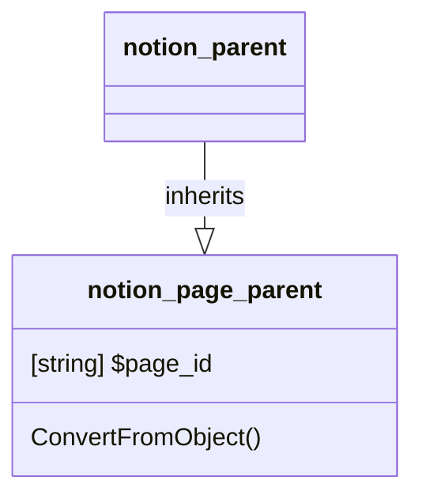

# Parent: Page

[API Reference](https://developers.notion.com/reference/parent-object#page-parent)

```mermaid
classDiagram
    class notion_page_parent {
        [string] $page_id
        ConvertFromObject()
    }
    `notion_parent` --|> `notion_page_parent`:inherits
```
