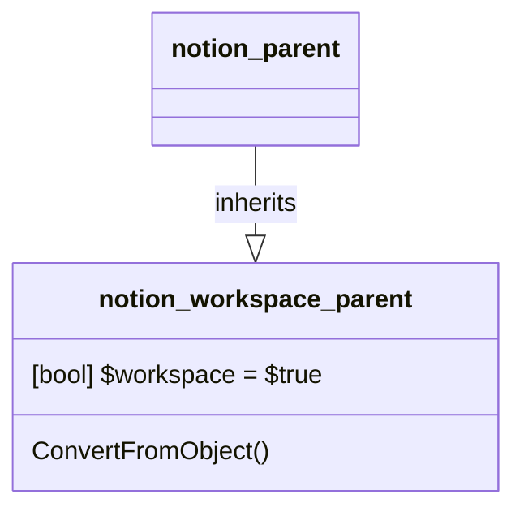

# Parent: Workspace

[API Reference](https://developers.notion.com/reference/parent-object#workspace-parent)

```mermaid
classDiagram
    class notion_workspace_parent {
    [bool] $workspace = $true
        ConvertFromObject()
    }
    `notion_parent` --|> `notion_workspace_parent`:inherits
```

## Related classes

- [notion_parent](./00_parent.md)
