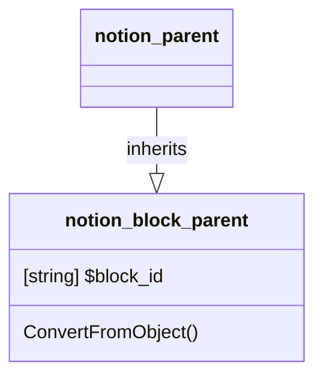

# Parent: Block

[API Reference](https://developers.notion.com/reference/parent-object#block-parent)

```mermaid
classDiagram
    class notion_block_parent {
        [string] $block_id
        ConvertFromObject()
    }
    `notion_parent` --|> `notion_block_parent`:inherits
```

## Related classes

- [notion_parent](./00_parent.md)
