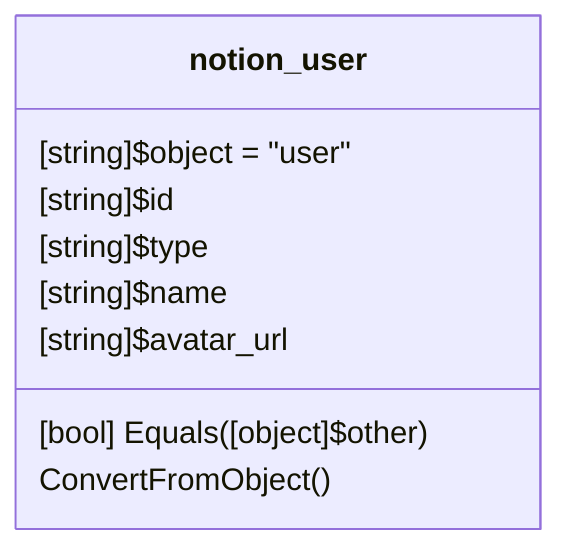

# User

[API Reference](https://developers.notion.com/reference/user)

```mermaid
classDiagram
    class notion_user {
        [string]$object = "user"
        [string]$id
        [string]$type
        [string]$name
        [string]$avatar_url
        [bool] Equals([object]$other)
        ConvertFromObject()
    }
```
