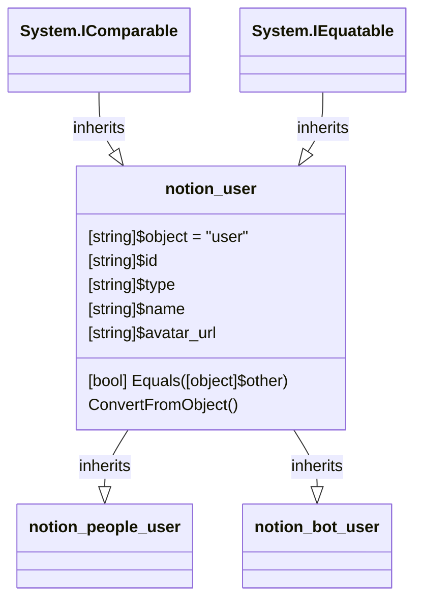

# User

[API Reference](https://developers.notion.com/reference/user)

```mermaid
classDiagram
    class notion_user {
        [string]$object = "user"
        [string]$id
        [string]$type
        [string]$name
        [string]$avatar_url
        [bool] Equals([object]$other)
        ConvertFromObject()
    }

    `notion_user` --|> `notion_people_user`:inherits
    `notion_user` --|> `notion_bot_user`:inherits
    `System.IComparable` --|> `notion_user`:inherits
    `System.IEquatable` --|> `notion_user`:inherits
```

## Related Classes

- [notion_people_user](02_people.md)
- [notion_bot_user](03_bot.md)
