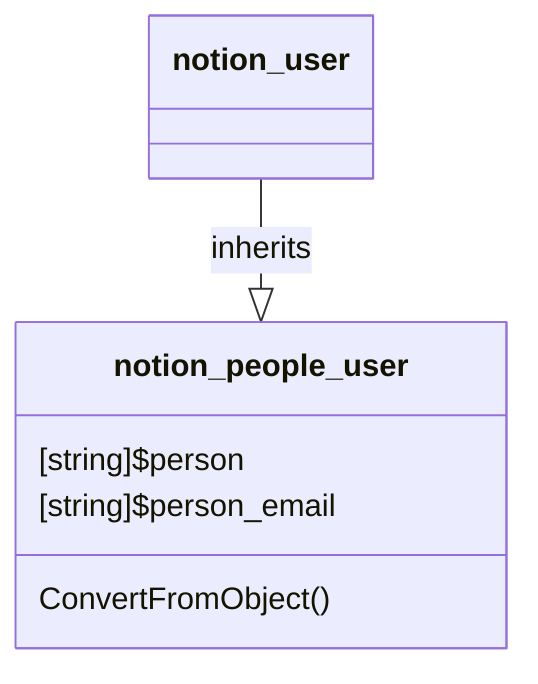

# User: People

[API Reference](https://developers.notion.com/reference/user#people)

```mermaid
classDiagram
    class notion_people_user {
        [string]$person
        [string]$person_email
        ConvertFromObject()
    }
    `notion_user` --|> `notion_people_user`:inherits
```

## Related Classes

- [notion_user](01_user.md)
- [notion_people_user](02_people.md)
